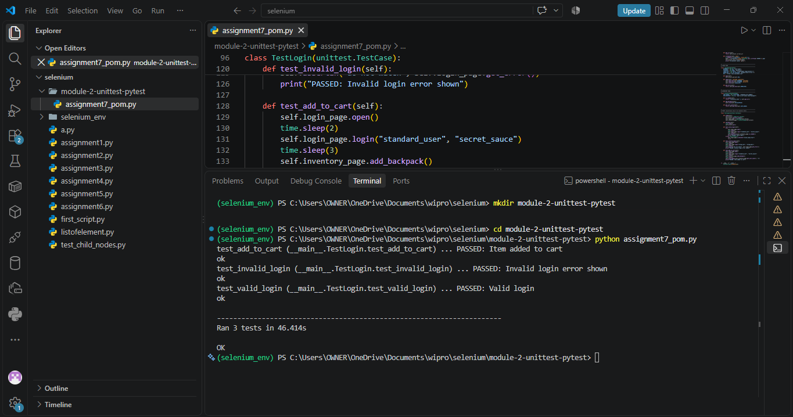
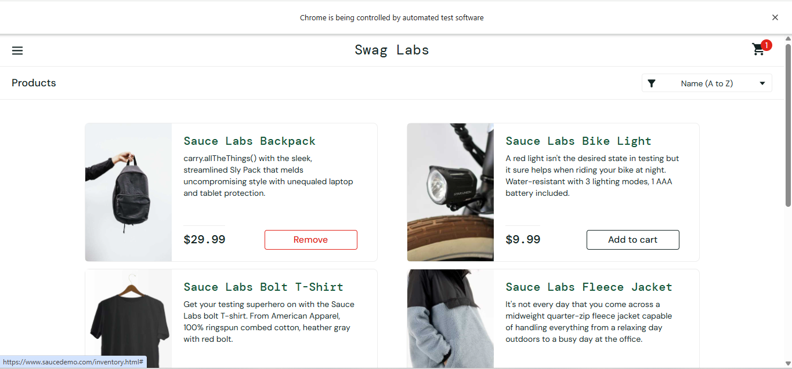
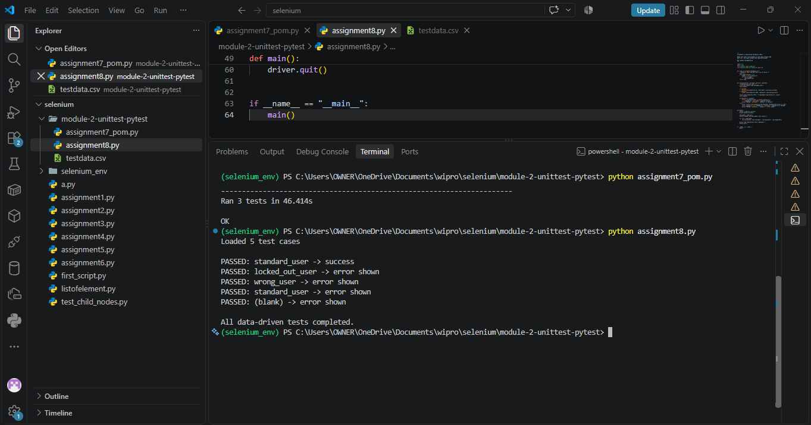
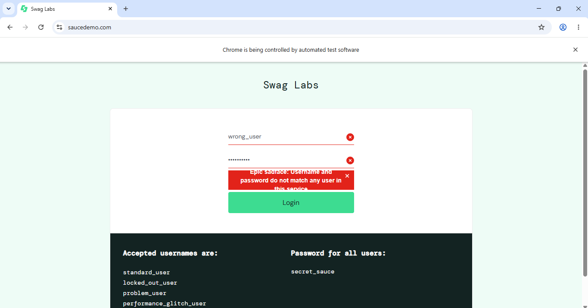

# Module 2: Unit Test Frameworks (Unittest + PyTest)

Covers Unittest, PyTest, fixtures, data-driven testing, and Page Object Model.

## Assignments

| # | Assignment | Code |
|---|------------|------|
| 7 | Page Object Model (POM) Restructure | [assignment7.py](assignment7.py) |
| 8 | Data-Driven Automation (DDT) | [assignment8.py](assignment8.py) |
| 9 | PyTest Integration with HTML Reporting | [assignment9.py](assignment9.py) |

## Output Screenshots

Assignment 7 — Page Object Model

**Terminal Output:**

**Browser Output:**

Assignment 8 — Data-Driven Automation

**Terminal Output:**

**Browser Output:**

