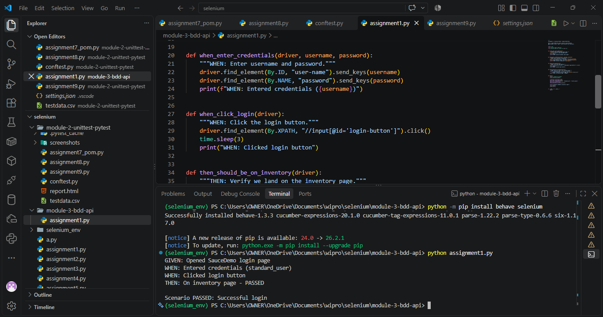
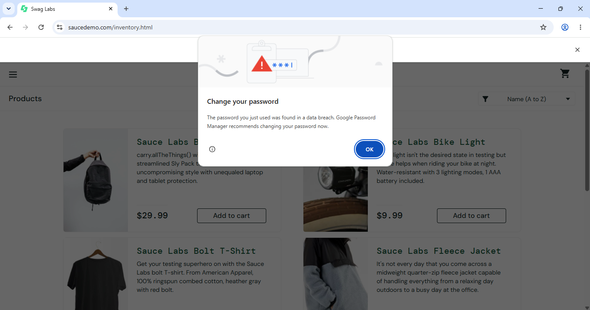
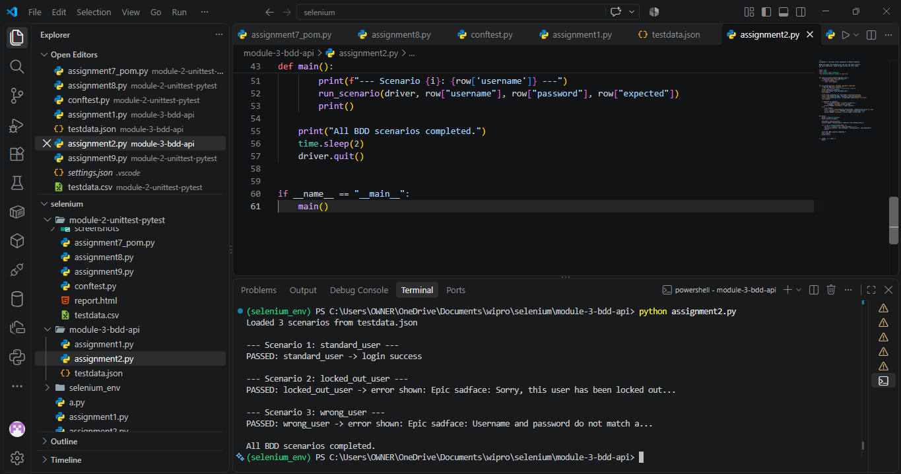
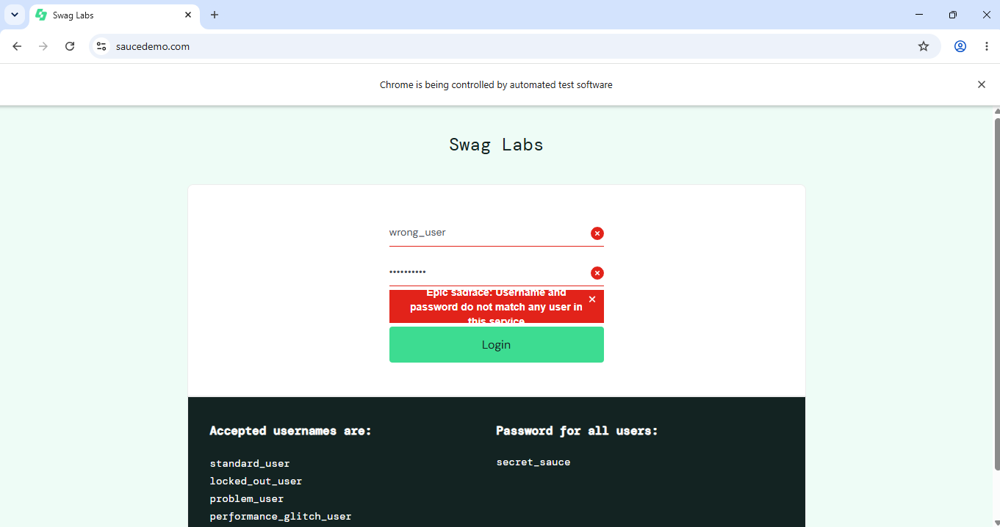
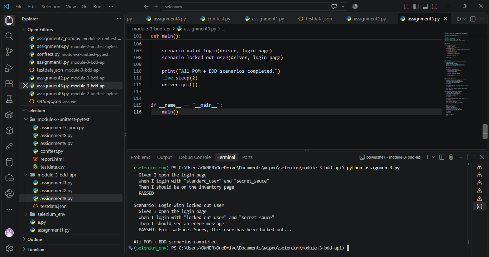
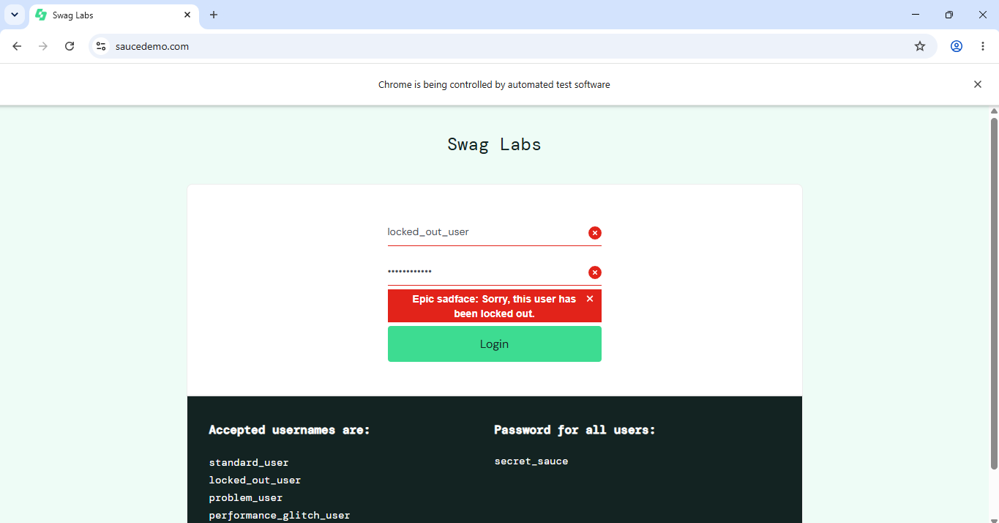

# Module 3: Python BDD RESTful Automation

Covers BDD concepts, Selenium automation, data-driven scenarios, and Page Object Model with BDD flow.

## Assignments

| # | Assignment | Code |
|---|------------|------|
| 1 | Selenium Python + Behave BDD Setup | [assignment1.py](assignment1.py) |
| 2 | Test Data Driven Automation | [assignment2.py](assignment2.py) |
| 3 | Selenium POM in Behave Framework | [assignment3.py](assignment3.py) |

## Output Screenshots

Assignment 1 — Behave BDD Setup

**Terminal Output:**

**Browser Output:**

Assignment 2 — Data-Driven Automation

**Terminal Output:**

**Browser Output:**

Assignment 3 — POM + Behave Framework

**Terminal Output:**

**Browser Output:**

