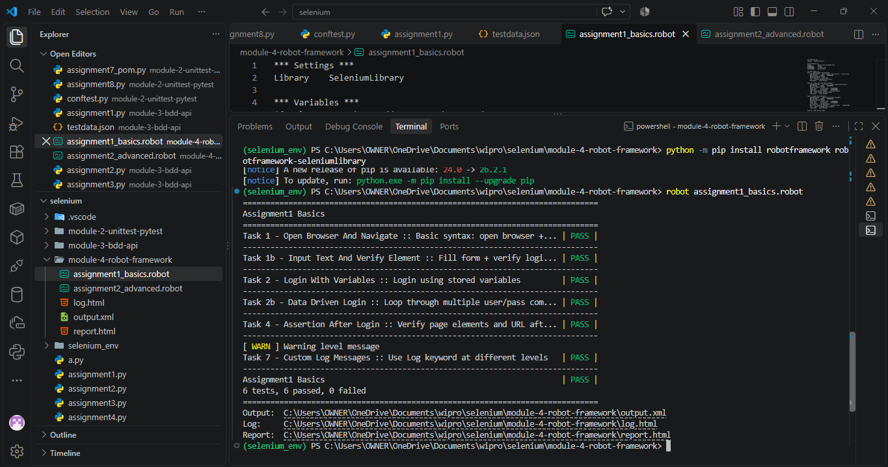
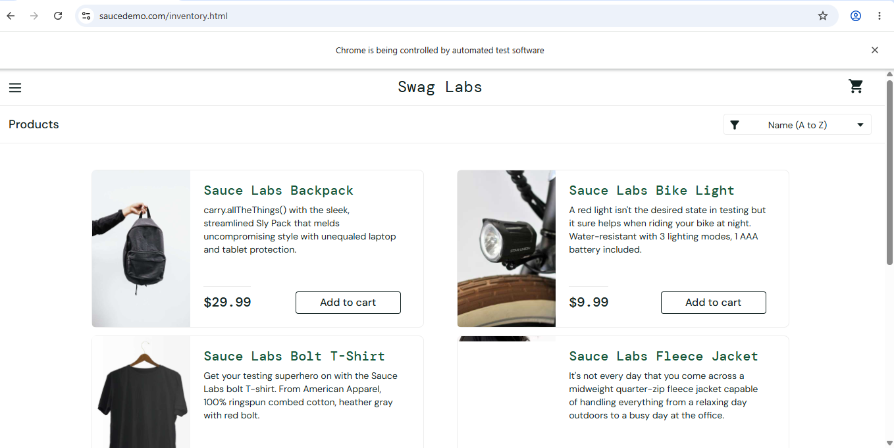
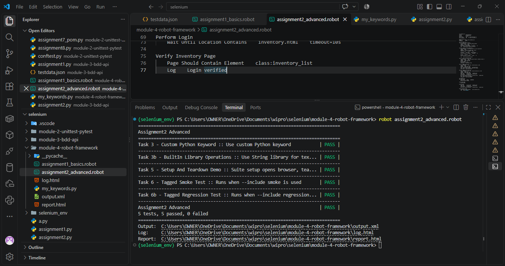

# Module 4: Robot Framework

Covers Robot Framework syntax, variables, data-driven tests, custom keywords, assertions, setup/teardown, tags, and reports.

## Assignments

| # | Assignment | Code |
|---|------------|------|
| 1 | Basics — Syntax, Variables, Assertions, Logs | [assignment1_basics.robot](assignment1_basics.robot) |
| 2 | Advanced — Custom Keywords, Setup/Teardown, Tags | [assignment2_advanced.robot](assignment2_advanced.robot) |

## Output Screenshots

Assignment 1 — Basics

**Terminal Output:**

**HTML Report:**

Assignment 2 — Advanced

**Terminal Output:**

