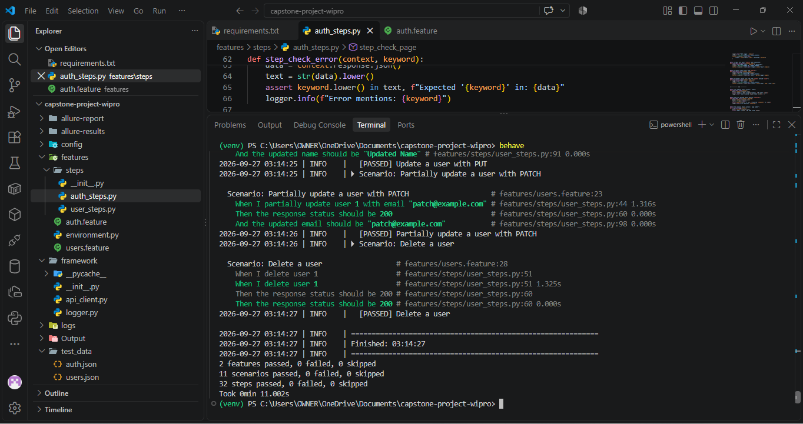
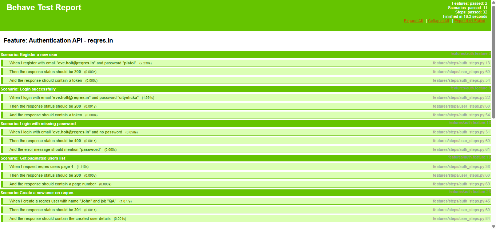
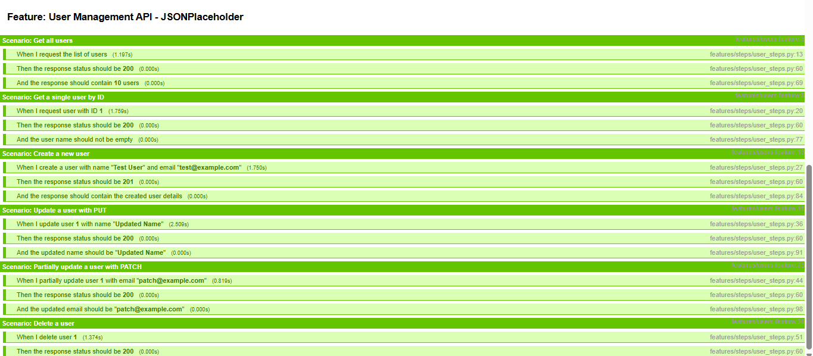
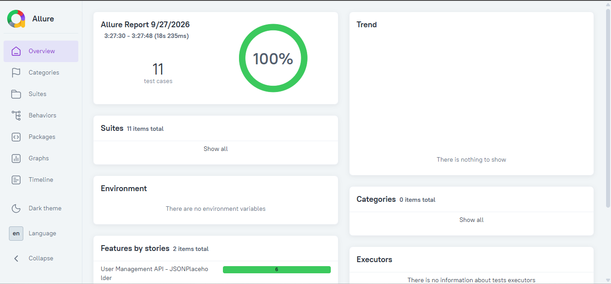

# 🚀 Capstone Project — API Automation Framework

A complete API Automation Framework built with **Python Requests + Behave BDD + Allure Reporting**.

## 1. Module Name
Module 3 — Python BDD RESTful Automation

## 2. Experiment Title
API Automation Framework with Python Requests + Behave BDD + Allure Reporting

## 3. Problem Statement
Build a scalable API test automation framework that validates User Management APIs of public REST services.

## 4. Objective
- Reusable API client using Python `requests`
- BDD-style feature files in Gherkin
- Step definitions using Behave
- CRUD + Authentication testing
- HTML and Allure reporting

## 5. Tools & Concepts

| Category | Details |
|---|---|
| Language | Python 3 |
| HTTP Library | `requests` |
| BDD Framework | `behave` |
| Reporting | Behave HTML + Allure |
| Logging | Python `logging` |
| APIs | `jsonplaceholder.typicode.com`, `reqres.in` |

## 6. Project Structure

```
capstone-project/
├── config/            → URLs, headers, timeouts
├── framework/         → Reusable API client + logger
├── features/          → BDD features + step definitions
├── test_data/         → JSON test data
├── Output/            → Reports + screenshots
├── allure-results/    → Raw Allure data
├── behave.ini         → Behave config
├── requirements.txt   → Dependencies
└── README.md
```

## 7. Setup

```bash
python -m venv venv
venv\Scripts\activate
pip install -r requirements.txt
```

## 8. Execution

```bash
behave
behave -f behave_html_formatter:HTMLFormatter -o Output/behave-report.html
behave -f allure_behave.formatter:AllureFormatter -o allure-results
allure serve allure-results
```

## 9. Test Coverage

| Feature File | Scenarios |
|---|---|
| `users.feature` | 6 — List, Get, Create, PUT, PATCH, Delete |
| `auth.feature` | 5 — Register, Login, Login failure, Pagination, Create |

**Total:** 2 features · 11 scenarios · 32 steps · **All passing**

## 10. Output

### Terminal


### Behave HTML Report — Top


### Behave HTML Report — Bottom


### Allure Report


## 11. Result & Observation

All 11 scenarios passed (**11 passed, 0 failed, 0 error**). The framework:
- Validated CRUD against JSONPlaceholder
- Authenticated against reqres.in with API key headers
- Handled the missing-password error case (400)
- Reused `APIClient` across all tests
- Generated HTML + Allure reports

## 12. Conclusion

Demonstrates a layered API automation framework with clean separation between feature files, step definitions, framework layer, config, and test data.
